

  

---

MyFlix is Netflix Redesigned Clone Android App. This Repo is for progress update and App preview.

### Feature

- **Get Latest Updates on Movies**
- **Directly Play Media** without ads
- **Search** Movies/ Tv Shows
- **Clean User Interface**

### ScreenShots

|            Splash             |             Home              |         Home Preview 2          |
| :---------------------------: | :---------------------------: | :-----------------------------: |
|   |   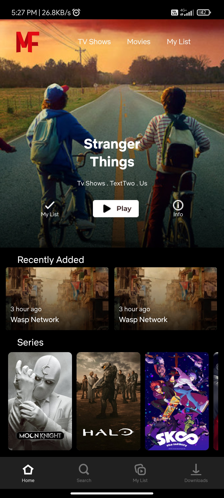    |   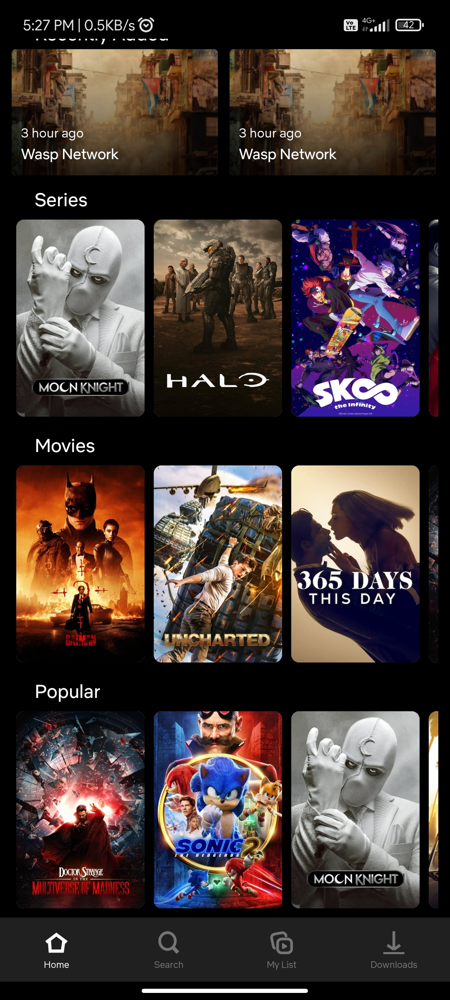    |
|            Detail             |       Detail Preview 2        |              Cast               |
| 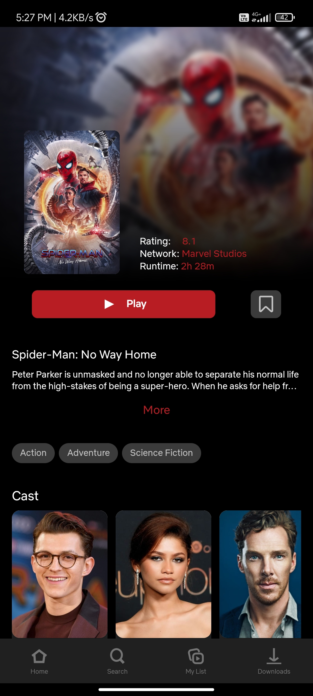 | 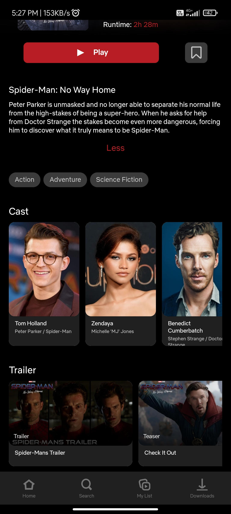 |    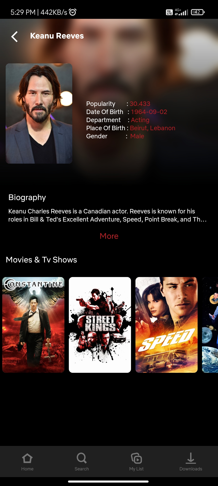    |
|        Cast Preview 2         |            Search             |        Search Preview 2         |
|  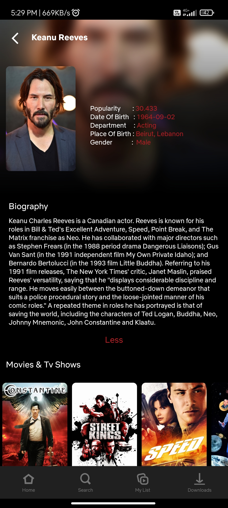   | 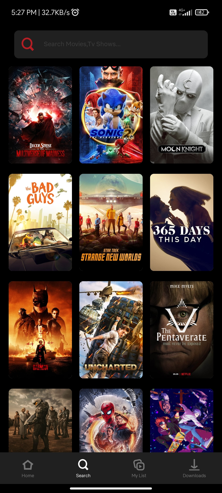 | 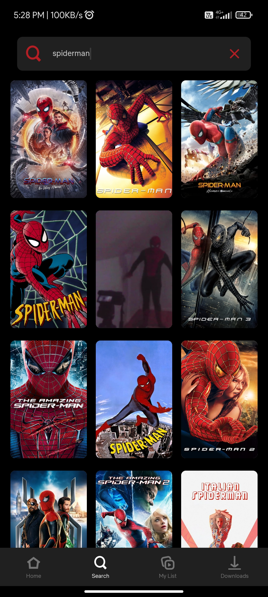  |
|            My List            |       My List Preview 2       |            Downloads            |
|  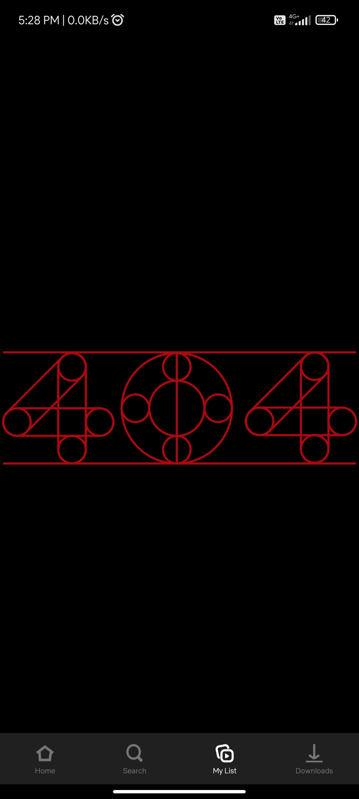   |  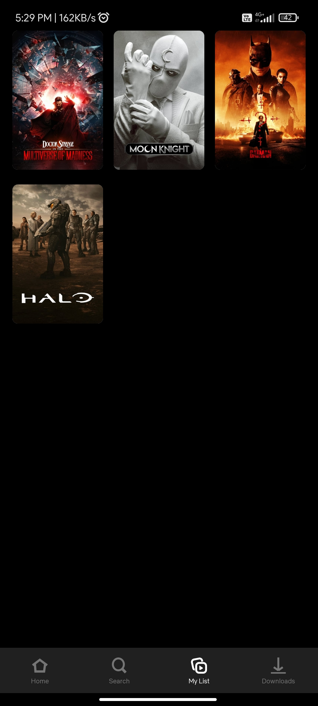   | 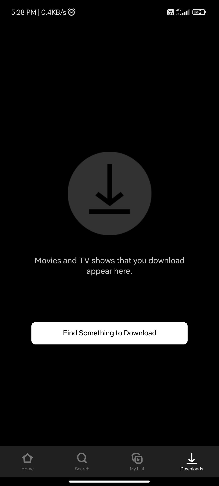 |

### Tech Stack

- [ Figma ](https://www.figma.com/file/0HMxMJvbims3fheuWXnMhX/Myflix?node-id=1%3A4) For UI/UX designing
- Kotlin
- [Jetpack Compose](https://developer.android.com/jetpack/compose) is Android’s modern toolkit for building native UI. It simplifies and accelerates UI development on Android. Quickly bring your app to life with less code, powerful tools, and intuitive Kotlin APIs.
- [Retrofit](https://square.github.io/retrofit/) A type-safe HTTP client for Android and Java
- TypeScript + ExpressJs for Custom Backend
- [Firebase Appcheck](https://firebase.google.com/docs/app-check) for Protecting backend Api from Un-Authenticated Access.

### Todo

- [x] Play Media
- [ ] Download Feature
- [ ] Optimize Image Rendering ( Issue with Jetpack compose recomposition )
- [ ] Release Build

---

Made with 💜 in India
